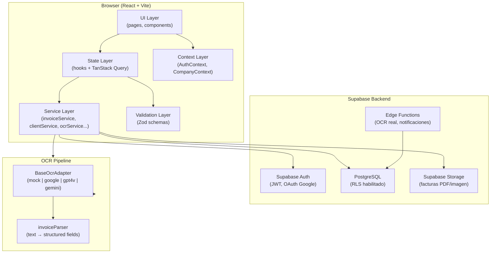
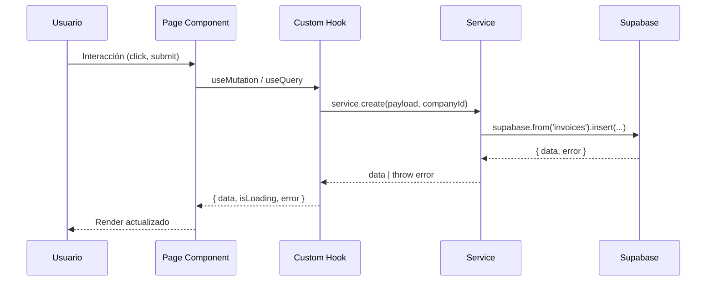
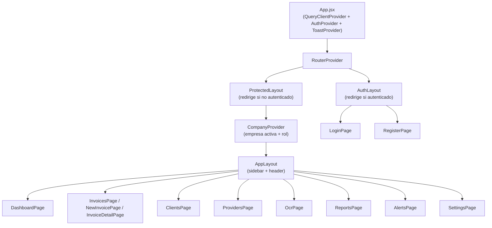
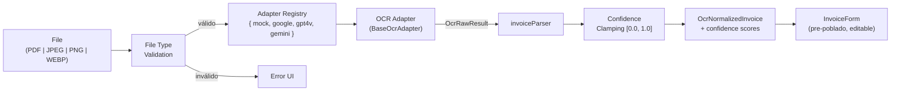
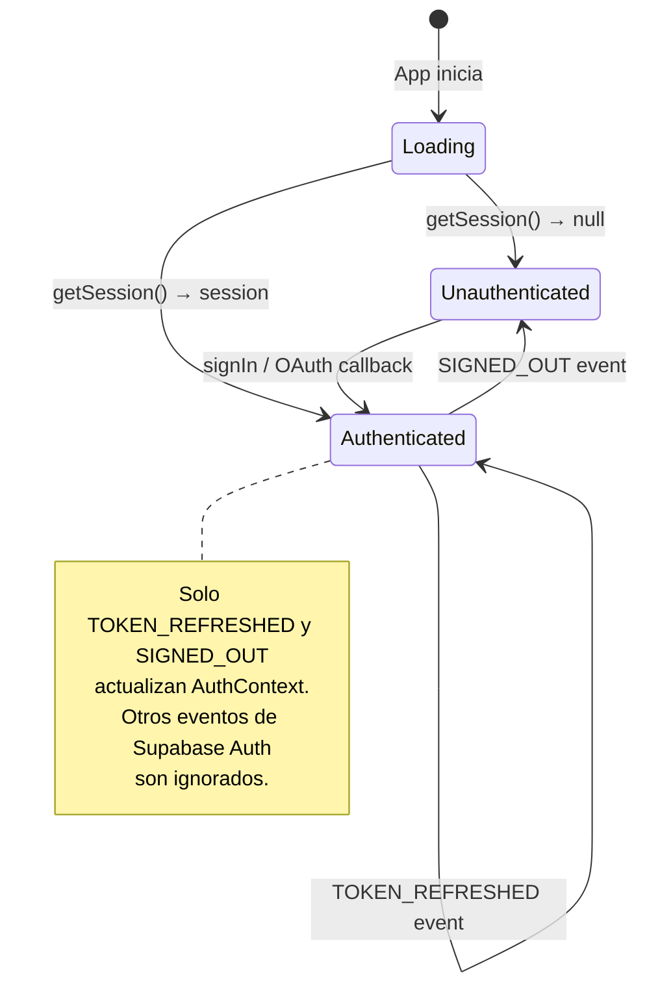

# Design Document — InvoTrack Master Spec

## Overview

InvoTrack es una plataforma SaaS para gestión inteligente de facturas con OCR y automatización contable, orientada a PyMEs argentinas. El sistema combina un frontend React + Vite + JavaScript con un backend Supabase (Auth, PostgreSQL, Storage, Edge Functions) para ofrecer extracción automática de datos de facturas, gestión multiempresa con aislamiento estricto, y un dashboard financiero en tiempo real.

### Decisiones de diseño clave

- **Feature-based architecture**: cada dominio funcional es un módulo autocontenido bajo `src/features/`.
- **Service/Hook pattern**: los servicios encapsulan acceso a Supabase (sin contexto React); los hooks conectan servicios con TanStack Query.
- **Adapter pattern para OCR**: permite intercambiar proveedores OCR sin modificar UI ni parser.
- **RLS como primera línea de defensa**: nunca desactivado; el frontend filtra por `company_id` como segunda capa.
- **JavaScript (JSX/JS)**: el proyecto se mantiene en JS sin migración a TypeScript.

---

## Architecture

### Diagrama de alto nivel



### Flujo de datos principal



### Capas y responsabilidades

| Capa | Ubicación | Responsabilidad | Restricciones |
|------|-----------|-----------------|---------------|
| UI | `pages/`, `components/` | Render, eventos de usuario | No llama a Supabase directamente |
| State | `hooks/` + TanStack Query | Cache del servidor, mutaciones | Solo usa Services |
| Service | `services/` | Queries a Supabase, lógica de negocio | No importa contextos React |
| Validation | `schemas/` | Validación Zod de formularios | Sin efectos secundarios |
| Context | `context/` | Estado global de sesión y empresa | Solo AuthContext y CompanyContext |

---

## Components and Interfaces

### Árbol de componentes principal



### Estructura de carpetas oficial

```
src/
├── app/
│   └── router.jsx
├── assets/
├── components/
│   └── ui/                     # shadcn/ui components
├── features/
│   ├── auth/
│   │   ├── context/AuthContext.jsx
│   │   ├── hooks/
│   │   ├── pages/
│   │   │   ├── LoginPage.jsx
│   │   │   └── RegisterPage.jsx
│   │   ├── schemas/authSchemas.js
│   │   ├── services/authService.js
│   ├── companies/
│   │   ├── context/CompanyContext.jsx
│   │   ├── hooks/
│   │   ├── pages/OnboardingPage.jsx
│   │   ├── services/companyService.js
│   ├── clients/
│   │   ├── components/
│   │   ├── hooks/useClients.js
│   │   ├── pages/ClientsPage.jsx
│   │   ├── schemas/clientSchemas.js
│   │   ├── services/clientService.js
│   ├── providers/              # Misma estructura que clients/
│   ├── invoices/
│   │   ├── components/
│   │   │   ├── InvoiceForm.jsx
│   │   │   ├── InvoiceTable.jsx
│   │   │   └── InvoiceStatusBadge.jsx
│   │   ├── hooks/
│   │   │   ├── useInvoices.js
│   │   │   └── useInvoicePayments.js
│   │   ├── pages/
│   │   │   ├── InvoicesPage.jsx
│   │   │   ├── NewInvoicePage.jsx
│   │   │   └── InvoiceDetailPage.jsx
│   │   ├── schemas/invoiceSchemas.js
│   │   ├── services/
│   │   │   ├── invoiceService.js
│   │   │   └── invoicePaymentService.js
│   ├── ocr/
│   │   ├── adapters/
│   │   │   ├── BaseOcrAdapter.js
│   │   │   ├── MockOcrAdapter.js
│   │   │   ├── GoogleDocumentAiAdapter.js
│   │   │   └── GeminiVisionAdapter.js
│   │   ├── parsers/invoiceParser.js
│   │   ├── services/ocrService.js
│   │   ├── pages/OcrPage.jsx
│   ├── dashboard/
│   │   ├── components/
│   │   │   ├── KpiCard.jsx
│   │   │   ├── RevenueChart.jsx
│   │   │   ├── InvoiceStatusChart.jsx
│   │   │   └── RecentInvoices.jsx
│   │   ├── hooks/useDashboard.js
│   │   └── pages/DashboardPage.jsx
│   ├── reports/
│   ├── alerts/
│   └── settings/
├── layouts/
│   ├── AppLayout.jsx
│   ├── AuthLayout.jsx
│   └── ProtectedLayout.jsx
└── lib/
    ├── database.js             # JSDoc shapes de las entidades
    ├── supabase.js             # Singleton cliente Supabase
    ├── queryClient.js          # Instancia TanStack QueryClient
    ├── constants.js            # IVA_RATES, ROUTES, QUERY_KEYS, etc.
    └── utils.js                # cn(), formatCurrency(), formatDate()
```

### Shapes de datos clave (JSDoc)

```js
// src/lib/database.js — shapes documentadas con JSDoc para autocompletado

/**
 * @typedef {'admin' | 'accountant' | 'viewer'} UserRole
 * @typedef {'draft' | 'pending' | 'paid' | 'overdue' | 'cancelled'} InvoiceStatus
 * @typedef {'receivable' | 'payable'} InvoiceFlowType
 * @typedef {'RI' | 'MO' | 'EX' | 'CF' | 'RS'} TaxCondition
 * @typedef {'contado' | 'cuenta_corriente'} CondicionPago
 */

/**
 * @typedef {Object} Company
 * @property {string} id
 * @property {string} name
 * @property {string|null} cuit
 * @property {string|null} address
 * @property {TaxCondition|null} tax_condition
 * @property {string|null} logo_url
 * @property {string} owner_id
 * @property {string} created_at
 * @property {string} updated_at
 */

/**
 * @typedef {Object} Invoice
 * @property {string} id
 * @property {string} company_id
 * @property {string} user_id
 * @property {string|null} client_id
 * @property {string|null} provider_id
 * @property {string} invoice_number
 * @property {string} tipo_comprobante
 * @property {number} punto_de_venta
 * @property {number} numero_comprobante
 * @property {InvoiceFlowType} type
 * @property {InvoiceStatus} status
 * @property {string} fecha_emision
 * @property {string|null} fecha_vencimiento
 * @property {CondicionPago} condicion_pago
 * @property {string} moneda
 * @property {number} tipo_cambio
 * @property {number} neto_gravado
 * @property {number} total_amount
 * @property {string|null} cae
 * @property {string|null} ocr_provider
 * @property {Object|null} ocr_confidence
 * @property {string|null} ocr_raw_text
 */
```

---

## Data Models

### Schema completo de base de datos PostgreSQL

```sql
-- profiles
CREATE TABLE profiles (
  id          UUID PRIMARY KEY REFERENCES auth.users(id) ON DELETE CASCADE,
  full_name   TEXT,
  avatar_url  TEXT,
  created_at  TIMESTAMPTZ NOT NULL DEFAULT NOW(),
  updated_at  TIMESTAMPTZ NOT NULL DEFAULT NOW()
);
ALTER TABLE profiles ENABLE ROW LEVEL SECURITY;
CREATE POLICY "profiles_own" ON profiles FOR ALL USING (auth.uid() = id);

-- companies
CREATE TABLE companies (
  id            UUID PRIMARY KEY DEFAULT uuid_generate_v4(),
  name          TEXT NOT NULL,
  cuit          VARCHAR(13),
  address       TEXT,
  tax_condition VARCHAR(2) CHECK (tax_condition IN ('RI','MO','EX','CF','RS')),
  logo_url      TEXT,
  owner_id      UUID NOT NULL REFERENCES auth.users(id),
  created_at    TIMESTAMPTZ NOT NULL DEFAULT NOW(),
  updated_at    TIMESTAMPTZ NOT NULL DEFAULT NOW()
);
ALTER TABLE companies ENABLE ROW LEVEL SECURITY;
CREATE POLICY "companies_owner" ON companies FOR ALL USING (owner_id = auth.uid());
CREATE POLICY "companies_member_read" ON companies FOR SELECT USING (
  EXISTS (SELECT 1 FROM user_roles WHERE company_id = companies.id AND user_id = auth.uid())
);

-- user_roles
CREATE TABLE user_roles (
  id          UUID PRIMARY KEY DEFAULT uuid_generate_v4(),
  company_id  UUID NOT NULL REFERENCES companies(id) ON DELETE CASCADE,
  user_id     UUID NOT NULL REFERENCES auth.users(id) ON DELETE CASCADE,
  role        TEXT NOT NULL CHECK (role IN ('admin','accountant','viewer')),
  created_at  TIMESTAMPTZ NOT NULL DEFAULT NOW(),
  UNIQUE (company_id, user_id)
);
ALTER TABLE user_roles ENABLE ROW LEVEL SECURITY;
CREATE POLICY "user_roles_own" ON user_roles FOR ALL USING (user_id = auth.uid());
CREATE POLICY "user_roles_admin_manage" ON user_roles FOR ALL USING (
  EXISTS (SELECT 1 FROM companies WHERE id = company_id AND owner_id = auth.uid())
);
```

```sql
-- clients
CREATE TABLE clients (
  id            UUID PRIMARY KEY DEFAULT uuid_generate_v4(),
  company_id    UUID NOT NULL REFERENCES companies(id) ON DELETE CASCADE,
  user_id       UUID NOT NULL REFERENCES auth.users(id),
  name          TEXT NOT NULL,
  cuit          VARCHAR(13),
  email         TEXT,
  phone         TEXT,
  address       TEXT,
  tax_condition VARCHAR(2) CHECK (tax_condition IN ('RI','MO','EX','CF','RS')),
  notes         TEXT,
  created_at    TIMESTAMPTZ NOT NULL DEFAULT NOW(),
  updated_at    TIMESTAMPTZ NOT NULL DEFAULT NOW()
);
ALTER TABLE clients ENABLE ROW LEVEL SECURITY;
CREATE POLICY "clients_company" ON clients FOR ALL USING (
  company_id IN (
    SELECT id FROM companies WHERE owner_id = auth.uid()
    UNION
    SELECT company_id FROM user_roles WHERE user_id = auth.uid()
  )
);
CREATE INDEX idx_clients_company ON clients(company_id);

-- providers (misma estructura que clients)
CREATE TABLE providers (
  id            UUID PRIMARY KEY DEFAULT uuid_generate_v4(),
  company_id    UUID NOT NULL REFERENCES companies(id) ON DELETE CASCADE,
  user_id       UUID NOT NULL REFERENCES auth.users(id),
  name          TEXT NOT NULL,
  cuit          VARCHAR(13),
  email         TEXT,
  phone         TEXT,
  address       TEXT,
  tax_condition VARCHAR(2) CHECK (tax_condition IN ('RI','MO','EX','CF','RS')),
  notes         TEXT,
  created_at    TIMESTAMPTZ NOT NULL DEFAULT NOW(),
  updated_at    TIMESTAMPTZ NOT NULL DEFAULT NOW()
);
ALTER TABLE providers ENABLE ROW LEVEL SECURITY;
CREATE POLICY "providers_company" ON providers FOR ALL USING (
  company_id IN (
    SELECT id FROM companies WHERE owner_id = auth.uid()
    UNION
    SELECT company_id FROM user_roles WHERE user_id = auth.uid()
  )
);
CREATE INDEX idx_providers_company ON providers(company_id);
```

```sql
-- invoices
CREATE TABLE invoices (
  id                     UUID PRIMARY KEY DEFAULT uuid_generate_v4(),
  company_id             UUID NOT NULL REFERENCES companies(id) ON DELETE CASCADE,
  user_id                UUID NOT NULL REFERENCES auth.users(id),
  client_id              UUID REFERENCES clients(id) ON DELETE SET NULL,
  provider_id            UUID REFERENCES providers(id) ON DELETE SET NULL,
  tipo_comprobante       TEXT NOT NULL,
  punto_de_venta         INTEGER CHECK (punto_de_venta BETWEEN 1 AND 99999),
  numero_comprobante     INTEGER,
  invoice_number         TEXT NOT NULL,
  type                   TEXT NOT NULL CHECK (type IN ('receivable','payable')),
  status                 TEXT NOT NULL DEFAULT 'pending'
                           CHECK (status IN ('draft','pending','paid','overdue','cancelled')),
  fecha_emision          DATE NOT NULL,
  fecha_vencimiento      DATE,
  condicion_pago         TEXT CHECK (condicion_pago IN ('contado','cuenta_corriente')),
  moneda                 CHAR(3) NOT NULL DEFAULT 'ARS',
  tipo_cambio            NUMERIC(10,4) NOT NULL DEFAULT 1.0000,
  emisor_cuit            VARCHAR(13),
  emisor_razon_social    TEXT,
  emisor_condicion_iva   VARCHAR(2) CHECK (emisor_condicion_iva IN ('RI','MO','EX','CF','RS')),
  emisor_domicilio       TEXT,
  receptor_cuit          VARCHAR(13),
  receptor_razon_social  TEXT,
  receptor_condicion_iva VARCHAR(2) CHECK (receptor_condicion_iva IN ('RI','MO','EX','CF','RS')),
  receptor_domicilio     TEXT,
  neto_gravado           NUMERIC(15,2) NOT NULL DEFAULT 0,
  neto_no_gravado        NUMERIC(15,2) NOT NULL DEFAULT 0,
  exento                 NUMERIC(15,2) NOT NULL DEFAULT 0,
  iva_105                NUMERIC(15,2) NOT NULL DEFAULT 0,
  iva_21                 NUMERIC(15,2) NOT NULL DEFAULT 0,
  iva_27                 NUMERIC(15,2) NOT NULL DEFAULT 0,
  otros_tributos         NUMERIC(15,2) NOT NULL DEFAULT 0,
  total_amount           NUMERIC(15,2) NOT NULL DEFAULT 0,
  cae                    VARCHAR(14),
  cae_vencimiento        DATE,
  afip_status            VARCHAR(50),
  ocr_provider           TEXT,
  ocr_confidence         JSONB,
  ocr_raw_text           TEXT,
  notes                  TEXT,
  created_at             TIMESTAMPTZ NOT NULL DEFAULT NOW(),
  updated_at             TIMESTAMPTZ NOT NULL DEFAULT NOW()
);
ALTER TABLE invoices ENABLE ROW LEVEL SECURITY;
CREATE POLICY "invoices_company" ON invoices FOR ALL USING (
  company_id IN (
    SELECT id FROM companies WHERE owner_id = auth.uid()
    UNION
    SELECT company_id FROM user_roles WHERE user_id = auth.uid()
  )
);
CREATE INDEX idx_invoices_company        ON invoices(company_id);
CREATE INDEX idx_invoices_company_status ON invoices(company_id, status);
CREATE INDEX idx_invoices_company_fecha  ON invoices(company_id, fecha_emision);

-- invoice_items
CREATE TABLE invoice_items (
  id              UUID PRIMARY KEY DEFAULT uuid_generate_v4(),
  invoice_id      UUID NOT NULL REFERENCES invoices(id) ON DELETE CASCADE,
  descripcion     TEXT NOT NULL,
  cantidad        NUMERIC(12,4) NOT NULL,
  unidad          VARCHAR(20),
  precio_unitario NUMERIC(15,2) NOT NULL,
  alicuota_iva    NUMERIC(5,2) NOT NULL CHECK (alicuota_iva IN (0, 10.5, 21, 27)),
  subtotal_neto   NUMERIC(15,2) NOT NULL,
  subtotal_iva    NUMERIC(15,2) NOT NULL,
  sort_order      INTEGER NOT NULL DEFAULT 0,
  created_at      TIMESTAMPTZ NOT NULL DEFAULT NOW()
);
ALTER TABLE invoice_items ENABLE ROW LEVEL SECURITY;
CREATE POLICY "invoice_items_via_invoice" ON invoice_items FOR ALL USING (
  invoice_id IN (
    SELECT id FROM invoices WHERE company_id IN (
      SELECT id FROM companies WHERE owner_id = auth.uid()
      UNION
      SELECT company_id FROM user_roles WHERE user_id = auth.uid()
    )
  )
);
CREATE INDEX idx_invoice_items_invoice ON invoice_items(invoice_id);
```

```sql
-- invoice_payments
CREATE TABLE invoice_payments (
  id             UUID PRIMARY KEY DEFAULT uuid_generate_v4(),
  invoice_id     UUID NOT NULL REFERENCES invoices(id) ON DELETE CASCADE,
  company_id     UUID NOT NULL REFERENCES companies(id) ON DELETE CASCADE,
  user_id        UUID NOT NULL REFERENCES auth.users(id),
  amount         NUMERIC(15,2) NOT NULL CHECK (amount > 0),
  payment_method TEXT NOT NULL CHECK (payment_method IN
                   ('transfer','cash','check','credit_card','debit_card','crypto','other')),
  payment_date   DATE NOT NULL,
  notes          TEXT,
  created_at     TIMESTAMPTZ NOT NULL DEFAULT NOW()
);
ALTER TABLE invoice_payments ENABLE ROW LEVEL SECURITY;
CREATE POLICY "invoice_payments_company" ON invoice_payments FOR ALL USING (
  company_id IN (
    SELECT id FROM companies WHERE owner_id = auth.uid()
    UNION
    SELECT company_id FROM user_roles WHERE user_id = auth.uid()
  )
);

-- alerts
CREATE TABLE alerts (
  id          UUID PRIMARY KEY DEFAULT uuid_generate_v4(),
  company_id  UUID NOT NULL REFERENCES companies(id) ON DELETE CASCADE,
  invoice_id  UUID REFERENCES invoices(id) ON DELETE CASCADE,
  type        TEXT NOT NULL CHECK (type IN ('overdue','upcoming','duplicate','anomaly')),
  message     TEXT NOT NULL,
  is_read     BOOLEAN NOT NULL DEFAULT FALSE,
  created_at  TIMESTAMPTZ NOT NULL DEFAULT NOW()
);
ALTER TABLE alerts ENABLE ROW LEVEL SECURITY;
CREATE POLICY "alerts_company" ON alerts FOR ALL USING (
  company_id IN (
    SELECT id FROM companies WHERE owner_id = auth.uid()
    UNION
    SELECT company_id FROM user_roles WHERE user_id = auth.uid()
  )
);

-- audit_logs
CREATE TABLE audit_logs (
  id          UUID PRIMARY KEY DEFAULT uuid_generate_v4(),
  company_id  UUID REFERENCES companies(id) ON DELETE SET NULL,
  user_id     UUID REFERENCES auth.users(id) ON DELETE SET NULL,
  action      TEXT NOT NULL,
  table_name  TEXT NOT NULL,
  record_id   UUID,
  old_data    JSONB,
  new_data    JSONB,
  created_at  TIMESTAMPTZ NOT NULL DEFAULT NOW()
);
ALTER TABLE audit_logs ENABLE ROW LEVEL SECURITY;
CREATE POLICY "audit_logs_admin" ON audit_logs FOR SELECT USING (
  company_id IN (SELECT id FROM companies WHERE owner_id = auth.uid())
);

-- attachments
CREATE TABLE attachments (
  id          UUID PRIMARY KEY DEFAULT uuid_generate_v4(),
  invoice_id  UUID NOT NULL REFERENCES invoices(id) ON DELETE CASCADE,
  file_name   TEXT NOT NULL,
  file_url    TEXT NOT NULL,
  file_size   INTEGER,
  mime_type   TEXT,
  created_at  TIMESTAMPTZ NOT NULL DEFAULT NOW()
);
ALTER TABLE attachments ENABLE ROW LEVEL SECURITY;
CREATE POLICY "attachments_via_invoice" ON attachments FOR ALL USING (
  invoice_id IN (
    SELECT id FROM invoices WHERE company_id IN (
      SELECT id FROM companies WHERE owner_id = auth.uid()
      UNION
      SELECT company_id FROM user_roles WHERE user_id = auth.uid()
    )
  )
);
```

### Triggers

```sql
CREATE OR REPLACE FUNCTION update_updated_at()
RETURNS TRIGGER LANGUAGE plpgsql AS $$
BEGIN NEW.updated_at = NOW(); RETURN NEW; END; $$;

CREATE TRIGGER invoices_updated_at  BEFORE UPDATE ON invoices  FOR EACH ROW EXECUTE FUNCTION update_updated_at();
CREATE TRIGGER clients_updated_at   BEFORE UPDATE ON clients   FOR EACH ROW EXECUTE FUNCTION update_updated_at();
CREATE TRIGGER providers_updated_at BEFORE UPDATE ON providers FOR EACH ROW EXECUTE FUNCTION update_updated_at();

CREATE OR REPLACE FUNCTION handle_new_user()
RETURNS TRIGGER LANGUAGE plpgsql SECURITY DEFINER AS $$
BEGIN
  INSERT INTO profiles (id, full_name, avatar_url)
  VALUES (NEW.id, NEW.raw_user_meta_data->>'full_name', NEW.raw_user_meta_data->>'avatar_url');
  RETURN NEW;
END; $$;

CREATE TRIGGER on_auth_user_created
  AFTER INSERT ON auth.users FOR EACH ROW EXECUTE FUNCTION handle_new_user();
```

### Vistas analíticas

```sql
CREATE OR REPLACE VIEW invoice_financial_summary AS
SELECT
  i.id AS invoice_id, i.company_id, i.type, i.status, i.total_amount,
  i.fecha_emision AS issue_date, i.fecha_vencimiento AS due_date, i.moneda AS currency,
  COALESCE(SUM(p.amount), 0) AS total_paid,
  GREATEST(i.total_amount - COALESCE(SUM(p.amount), 0), 0) AS total_pending,
  COALESCE(SUM(p.amount), 0) >= i.total_amount AS is_fully_paid,
  i.fecha_vencimiento < CURRENT_DATE
    AND COALESCE(SUM(p.amount), 0) < i.total_amount AS is_overdue
FROM invoices i
LEFT JOIN invoice_payments p ON p.invoice_id = i.id
GROUP BY i.id;

CREATE OR REPLACE VIEW company_cash_flow AS
SELECT
  i.company_id, i.type, i.moneda AS currency,
  COUNT(i.id) AS invoice_count,
  SUM(i.total_amount) AS total_invoiced,
  COALESCE(SUM(s.total_paid), 0) AS total_collected,
  COALESCE(SUM(s.total_pending), 0) AS total_pending,
  COALESCE(SUM(CASE WHEN s.is_overdue THEN s.total_pending ELSE 0 END), 0) AS total_overdue
FROM invoices i
LEFT JOIN invoice_financial_summary s ON s.invoice_id = i.id
GROUP BY i.company_id, i.type, i.moneda;
```

---

## OCR Pipeline Architecture

### Diagrama del pipeline



### Implementación del patrón Adapter

```js
// src/features/ocr/services/ocrService.js
const adapters = {
  mock:   new MockOcrAdapter(),
  google: new GoogleDocumentAiAdapter(),
  gpt4v:  new Gpt4VisionAdapter(),
  gemini: new GeminiVisionAdapter(),
}

export const ocrService = {
  async processInvoice(file, provider = 'mock') {
    const adapter = adapters[provider]
    if (!adapter) throw new Error(`OCR adapter '${provider}' not found`)
    const raw = await adapter.extractText(file)
    const normalized = parseInvoiceFromText(raw.rawText)
    const clamped = clampConfidenceScores(normalized.confidence)
    return { raw, normalized: { ...normalized, confidence: clamped } }
  }
}

function clampConfidenceScores(scores) {
  return Object.fromEntries(
    Object.entries(scores).map(([k, v]) => [k, Math.min(1.0, Math.max(0.0, v))])
  )
}
```

El parser **nunca lanza excepciones** para texto no parseable — retorna campos `null` con confidence `0.1`, permitiendo que el usuario vea y corrija el formulario manualmente.

---

## Authentication & Multi-Company System

### Flujo de autenticación



### Jerarquía de providers en App.tsx

```js
export default function App() {
  return (
    <QueryClientProvider client={queryClient}>
      <AuthProvider>
        <CompanyProvider>
          <ToastProvider>
            <RouterProvider router={router} />
          </ToastProvider>
        </CompanyProvider>
      </AuthProvider>
    </QueryClientProvider>
  )
}
```

### Lógica de roles y permisos

| Rol | Leer | Crear/Editar | Eliminar | Gestionar usuarios |
|-----|------|--------------|----------|--------------------|
| `admin` (owner) | ✅ | ✅ | ✅ | ✅ |
| `admin` (user_roles) | ✅ | ✅ | ✅ | ✅ |
| `accountant` | ✅ | ✅ | ❌ | ❌ |
| `viewer` | ✅ | ❌ | ❌ | ❌ |

### Flujo de onboarding

```mermaid
flowchart TD
    A[Usuario autenticado] --> B{¿Tiene empresas?}
    B -->|Sí| C[Seleccionar empresa activa]
    B -->|No| D[OnboardingPage: crear empresa]
    D --> E[companyService.create()]
    E --> F[CompanyContext.refetch()]
    F --> C
    C --> G[Dashboard]
```

---

## Key Design Patterns

### Service/Hook Pattern

```js
// SERVICE — agnóstico a React, recibe company_id como parámetro
export const invoiceService = {
  async getAll({ companyId, page = 1, pageSize = 20, status, type, search, dateFrom, dateTo }) {
    let query = supabase
      .from('invoices')
      .select('*, invoice_items(*)', { count: 'exact' })
      .eq('company_id', companyId)
      .order('fecha_emision', { ascending: false })
      .range((page - 1) * pageSize, page * pageSize - 1)
    if (status)   query = query.eq('status', status)
    if (type)     query = query.eq('type', type)
    if (search)   query = query.ilike('invoice_number', `%${search}%`)
    if (dateFrom) query = query.gte('fecha_emision', dateFrom)
    if (dateTo)   query = query.lte('fecha_emision', dateTo)
    const { data, error, count } = await query
    if (error) throw error
    return { data: data ?? [], count: count ?? 0 }
  }
}

// HOOK — conecta el service con TanStack Query
export function useInvoices(filters) {
  const { company } = useCompany()
  return useQuery({
    queryKey: [QUERY_KEYS.INVOICES, company?.id, filters],
    queryFn: () => invoiceService.getAll({ ...filters, companyId: company.id }),
    enabled: Boolean(company?.id),
  })
}
```

### Zod Schema Pattern

```js
const IVA_VALID_RATES = [0, 10.5, 21, 27]

export const invoiceItemSchema = z.object({
  descripcion:     z.string().min(1, 'Descripción requerida'),
  cantidad:        z.coerce.number().positive(),
  precio_unitario: z.coerce.number().positive(),
  alicuota_iva:    z.coerce.number().refine(
    (v) => IVA_VALID_RATES.includes(v),
    { message: 'Alícuota IVA inválida. Valores permitidos: 0, 10.5, 21, 27' }
  ),
})

export const cuitSchema = z.string().regex(
  /^\d{2}-\d{8}-\d$/,
  'CUIT inválido. Formato esperado: XX-XXXXXXXX-X'
)
```

### Debounce + URL params para búsqueda

```typescript
// Debounce 300ms: actualiza URL params solo después del delay
// La consulta se ejecuta de forma conjunta al expirar el debounce
useEffect(() => {
  const timer = setTimeout(() => {
    setSearchParams(prev => {
      if (inputValue) prev.set('search', inputValue)
      else prev.delete('search')
      return prev
    })
  }, 300)
  return () => clearTimeout(timer)
}, [inputValue])
```

### Atomicidad en creación de facturas

```js
async create({ items = [], ...invoice }) {
  const { data: newInvoice, error: invError } = await supabase
    .from('invoices').insert(invoice).select().single()
  if (invError) throw invError

  if (items.length > 0) {
    const { error: itemsError } = await supabase
      .from('invoice_items')
      .insert(items.map((item, idx) => ({ ...item, invoice_id: newInvoice.id, sort_order: idx })))
    if (itemsError) {
      await supabase.from('invoices').delete().eq('id', newInvoice.id)
      throw itemsError
    }
  }
  return newInvoice
}
```m('invoices').delete().eq('id', newInvoice.id)
      throw itemsError
    }
  }
  return newInvoice
}
```

### Determinación de estado por pagos

```typescript
async registerPayment(invoiceId: string, companyId: string, payment: PaymentInput) {
  const { data: newPayment, error } = await supabase
    .from('invoice_payments')
    .insert({ ...payment, invoice_id: invoiceId, company_id: companyId })
    .select().single()
  if (error) throw error

  const { data: payments } = await supabase
    .from('invoice_payments').select('amount').eq('invoice_id', invoiceId)
  const totalPaid = payments?.reduce((sum, p) => sum + Number(p.amount), 0) ?? 0

  const { data: invoice } = await supabase
    .from('invoices').select('total_amount').eq('id', invoiceId).single()
  const newStatus = totalPaid >= Number(invoice!.total_amount) ? 'paid' : 'pending'
  await supabase.from('invoices').update({ status: newStatus }).eq('id', invoiceId)
  return newPayment
}
```

---

## Correctness Properties

*Una propiedad es una característica o comportamiento que debe ser verdadero en todas las ejecuciones válidas del sistema. Las propiedades sirven como puente entre especificaciones legibles por humanos y garantías de corrección verificables por máquinas.*

La biblioteca elegida para PBT es **[fast-check](https://fast-check.io/)** — estándar para TypeScript/JavaScript, con soporte nativo para generadores de tipos complejos y shrinking automático de contraejemplos. Cada property test debe ejecutar **mínimo 100 iteraciones**.

---

### Property 1: Clamping de confidence scores

*Para cualquier* objeto de confidence scores con valores arbitrarios (incluyendo negativos, mayores a 1), después de aplicar `clampConfidenceScores`, todos los valores del resultado deben estar en el rango `[0.0, 1.0]`.

**Validates: Requirements 6.4**

---

### Property 2: Conversión de fechas argentinas (round-trip)

*Para cualquier* fecha válida en formato `DD/MM/YYYY`, la función `parseDate` debe producir una cadena `YYYY-MM-DD` que, al ser re-formateada a `DD/MM/YYYY`, produce la fecha original.

**Validates: Requirements 6.10**

---

### Property 3: Round-trip del parser OCR

*Para cualquier* texto de factura argentina válido, parsear → formatear → parsear debe producir un resultado estructuralmente equivalente al primero (mismos campos no-nulos, mismos valores numéricos).

**Validates: Requirements 6.11**

---

### Property 4: Validación de alícuotas IVA

*Para cualquier* alícuota fuera del conjunto `{0, 10.5, 21, 27}`, el schema Zod `invoiceItemSchema` debe rechazarla. *Para cualquier* alícuota dentro del conjunto, debe aceptarla.

**Validates: Requirements 5.7**

---

### Property 5: Determinación de estado por pagos

*Para cualquier* factura con `total_amount` T y lista de pagos P: si `sum(P) >= T` entonces `status = 'paid'`; si `sum(P) < T` entonces `status = 'pending'`. Válido para pagos fraccionados, exactos y sobrepagos.

**Validates: Requirements 5.4, 5.5, 5.6**

---

### Property 6: Filtrado de facturas preserva invariante de pertenencia

*Para cualquier* colección de facturas y combinación de filtros activos, todos los elementos del resultado deben satisfacer simultáneamente todos los filtros aplicados.

**Validates: Requirements 5.8, 9.1**

---

### Property 7: Validación de formato CUIT

*Para cualquier* string, `cuitSchema` debe aceptar exactamente los strings con formato `XX-XXXXXXXX-X` y rechazar todos los demás.

**Validates: Requirements 8.6**

---

### Property 8: Cálculo de totales de factura

*Para cualquier* lista de ítems válidos, `calculateInvoiceTotals` debe producir un `total_amount` igual a `sum(cantidad × precio_unitario × (1 + alicuota_iva/100))` para todos los ítems.

**Validates: Requirements 5.7**

---

### Property 9: Búsqueda de clientes por nombre

*Para cualquier* lista de clientes y término de búsqueda no vacío, todos los clientes retornados deben contener el término en su campo `name` (case-insensitive).

**Validates: Requirements 8.3**

---

### Property 10: Flujo de caja basado en pagos reales

*Para cualquier* conjunto de facturas con `status = 'paid'` pero sin registros en `invoice_payments`, la vista `company_cash_flow` debe mostrar `total_collected = 0`. El estado de la factura no influye en el cálculo.

**Validates: Requirements 11.4**

---

### Property 11: Validación Zod rechaza inputs inválidos

*Para cualquier* objeto que no satisfaga `invoiceSchema`, la validación debe retornar un error antes de que el dato llegue a Supabase. *Para cualquier* objeto válido, debe pasar sin errores.

**Validates: Requirements 13.2**

---

## Error Handling

### Estrategia por capa

| Capa | Tipo de error | Estrategia |
|------|---------------|------------|
| Zod Schema | Validación de formulario | `react-hook-form` muestra errores inline por campo |
| Service | PostgrestError de Supabase | `throw error` — el hook lo captura |
| Hook (useQuery) | Error de red / Supabase | `error` state de TanStack Query → UI muestra mensaje |
| Hook (useMutation) | Error de mutación | `onError` callback → toast de error |
| OCR Adapter | Proveedor no disponible | `throw new Error('OCR adapter not found')` |
| OCR Parser | Texto no parseable | Retorna campos `null` con confidence `0.1` (nunca lanza) |
| ProtectedLayout | Sin sesión | Redirige a `/login` |
| CompanyProvider | Sin empresa | Redirige a `/onboarding` |

---

## Security Considerations

### Modelo de seguridad en capas

```
┌─────────────────────────────────────────────────────────┐
│  Capa 1: Validación de inputs (Zod)                     │
│  → Rechaza datos malformados antes de llegar a Supabase │
├─────────────────────────────────────────────────────────┤
│  Capa 2: Filtrado por company_id en el frontend         │
│  → Todos los services reciben company_id como parámetro │
│  → Aplica independientemente del estado de RLS          │
├─────────────────────────────────────────────────────────┤
│  Capa 3: RLS en PostgreSQL (NUNCA desactivar)           │
│  → Aislamiento garantizado a nivel de base de datos     │
├─────────────────────────────────────────────────────────┤
│  Capa 4: JWT de Supabase Auth                           │
│  → Autenticación stateless, renovación automática       │
└─────────────────────────────────────────────────────────┘
```

### Reglas non-negotiable

1. RLS nunca desactivado en ninguna tabla ni entorno.
2. Sin `any` en TypeScript sin comentario de justificación.
3. Sin llamadas directas a Supabase desde componentes React.
4. `VITE_SUPABASE_URL` y `VITE_SUPABASE_ANON_KEY` solo desde `.env`.
5. Todo contenido de OCR o notas renderizado como texto plano (no `innerHTML`).
6. `AuthContext` solo reacciona a `TOKEN_REFRESHED` y `SIGNED_OUT`.
7. HTTPS requerido únicamente en producción.

### Configuración del alias `@/` en Vite

```js
// vite.config.js
import { defineConfig } from 'vite'
import react from '@vitejs/plugin-react'
import path from 'path'

export default defineConfig({
  plugins: [react()],
  resolve: {
    alias: { '@': path.resolve(__dirname, './src') }
  }
})
```

---

## Testing Strategy

### Cobertura por módulo

| Módulo | Unit Tests | Property Tests |
|--------|-----------|----------------|
| `invoiceParser` | ✅ casos específicos | ✅ Props 2, 3 |
| `clampConfidenceScores` | ✅ valores límite | ✅ Prop 1 |
| `calculateInvoiceTotals` | ✅ ejemplos AFIP | ✅ Prop 8 |
| `invoiceItemSchema` (Zod) | ✅ válidos/inválidos | ✅ Props 4, 11 |
| `cuitSchema` (Zod) | ✅ CUITs reales | ✅ Prop 7 |
| `invoicePaymentService` | ✅ pago exacto/parcial | ✅ Prop 5 |
| `invoiceService.getAll` | ✅ filtros individuales | ✅ Prop 6 |
| `clientService.getAll` | ✅ búsqueda exacta | ✅ Prop 9 |
| `company_cash_flow` view | — | ✅ Prop 10 |
| `AuthContext` | ✅ eventos auth | — |
| `CompanyContext` | ✅ switchCompany | — |

### Instalación

```bash
npm install --save-dev vitest @vitest/coverage-v8 fast-check
```

### Ejemplo de property test

```typescript
// Feature: invotrack-master-spec, Property 5: determinación de estado por pagos
it('Property 5: estado determinado por suma de pagos', () => {
  fc.assert(
    fc.property(
      fc.float({ min: 1, max: 100000, noNaN: true }),
      fc.array(fc.float({ min: 0.01, max: 50000, noNaN: true }), { minLength: 0, maxLength: 10 }),
      (totalAmount, payments) => {
        const totalPaid = payments.reduce((sum, p) => sum + p, 0)
        const status = determineInvoiceStatus(totalAmount, totalPaid)
        return totalPaid >= totalAmount ? status === 'paid' : status === 'pending'
      }
    ),
    { numRuns: 100 }
  )
})
```

